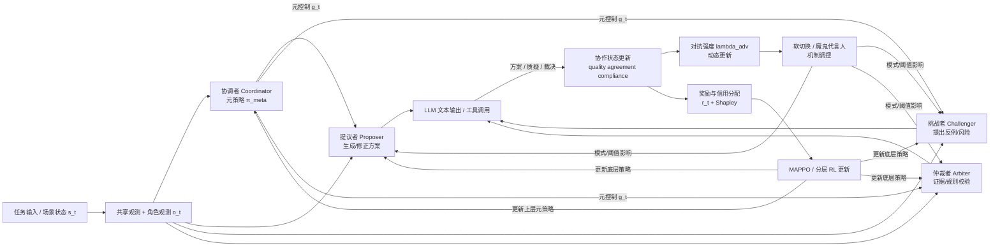

# debate_rl_v2

**面向通用智能体的对抗性协作机制：知识增强的分层强化学习框架**

`debate_rl_v2` 不是“几个 Agent 做多轮对话”的工程拼装，而是把**多角色辩论、知识约束、机制调控与分层强化学习**统一到一个通用智能体框架中的研究型实现。它的目标不是生成更多话，而是在约束、分歧、证据和元控制共同作用下，得到**可收敛、可解释、可持续改进**的群体决策过程。

这份 README 按照理论文档《面向通用智能体的对抗性协作机制：知识增强的分层强化学习方法》的写法组织：**先理论，后工程实践**。

---

## 一分钟概念概览

先用一张图建立直观印象：`debate_rl_v2` 的核心不是“多个 LLM 轮流发言”，而是让四个角色在**机制控制 + 奖励反馈 + 知识约束**下形成一个可学习的闭环。



这张图对应当前实现中的四条主线：

- **任务主线**：任务输入经过观测编码后，送入四角色协作。
- **LLM 主线**：提议、挑战、仲裁都通过 LLM 或工具形成可解释输出。
- **机制主线**：`lambda_adv`、软切换和魔鬼代言人共同决定何时放大分歧、何时验证收敛。
- **学习主线**：状态转移产生奖励，奖励再通过 MAPPO、分层更新和 Shapley 校正反作用于策略。

---

## 1. 摘要

单一智能体在复杂决策任务中常因偏见、知识盲区和过早收敛而产生次优解。`debate_rl_v2` 受人类多学科团队辩论实践启发，引入提议者、挑战者、仲裁者、协调者四个角色，将协作过程形式化为受约束的多智能体博弈。

框架的核心不是“让角色互相说话”，而是让系统具备以下能力：

1. 通过**动态对抗强度**控制分歧何时被放大、何时被收敛。
2. 通过**知识验证与证据链**把规则约束纳入决策闭环。
3. 通过**概率软切换**避免辩论阶段切换时出现刚性振荡。
4. 通过**魔鬼代言人验证**抑制虚假共识。
5. 通过**知识增强的分层强化学习**让底层角色策略与上层协议控制共同演化。

因此，`debate_rl_v2` 更准确的定位是：

- 一个通用的**对抗性协作机制研究框架**
- 一个把**LLM、工具、知识、RL 与元控制**统一起来的实验平台
- 一个支持从理论机制到工程实现逐层映射的基础设施

---

## 2. 研究目标与核心贡献

### 2.1 研究目标

给定一个复杂决策任务，学习一组多角色策略，使系统能够在满足领域约束的前提下：

- 提高最终决策质量
- 缩短达成高质量共识的路径
- 抑制错误但稳定的虚假共识
- 在规则变化、任务变化和历史经验积累后持续适应

### 2.2 核心贡献

1. **结构化辩论博弈形式化**  
   将提议者、挑战者、仲裁者、协调者建模为受约束的多智能体博弈系统，而非脚本式角色对话。

2. **动态对抗强度调节**  
   使用分歧、分歧变化率和时间压力共同决定对抗强度，使系统呈现“探索、冲突、验证、收敛”的节奏。

3. **知识验证与证据链追踪**  
   将规则满足度、规则置信度与决策依据写入闭环，不把知识库当作静态提示词附件。

4. **概率软切换与魔鬼代言人机制**  
   保证阶段转换平滑，并在近似共识阶段进行对抗鲁棒性验证。

5. **知识增强的分层强化学习**  
   上层学习协议和机制参数，下层学习角色行为策略，二者通过双时间尺度共同收敛。

---

## 3. 问题形式化

### 3.1 实现一致性说明

本文档遵循理论文档《面向通用智能体的对抗性协作机制：知识增强的分层强化学习方法》的组织方式，但下面给出的数学对象优先采用**当前项目真实实现中的具体形式**。换言之：

- 先给出理论定义
- 再给出当前代码实际使用的方程
- 最后说明这些方程分别落在什么模块

这样做的目的不是缩小理论外延，而是保证 README 中的数学描述可以直接映射到 `debate_rl_v2` 当前代码，而不是停留在尚未实现的广义构想上。

### 3.2 受限部分可观测马尔可夫博弈

当前框架将多角色协作抽象为受限部分可观测马尔可夫博弈：

$$
\mathcal{G} = \langle \mathcal{N}, \mathcal{S}, \{\mathcal{O}^i\}_{i\in\mathcal{N}}, \{\mathcal{A}^i\}_{i\in\mathcal{N}}, \mathcal{P}, \{\mathcal{R}^i\}_{i\in\mathcal{N}}, \mathcal{C}, \gamma \rangle
$$

其中：

- $\mathcal{N} = \{P, C, A, CO\}$：提议者、挑战者、仲裁者、协调者
- $\mathcal{S}$：全局协作状态
- $\mathcal{O}^i$：角色 $i$ 的局部观测
- $\mathcal{A}^i$：角色 $i$ 的动作或控制信号空间
- $\mathcal{P}$：环境转移与机制更新
- $\mathcal{R}^i$：按角色定义的奖励函数
- $\mathcal{C}$：合规、知识、终止等约束集合
- $\gamma \in (0,1)$：折扣因子

在当前实现里，全局状态不是抽象黑箱，而是由任务进展、辩论状态和机制状态共同组成。可写成

$$
s_t = \big(x_t, y_t, z_t, q_t, a_t, c_t, \lambda_t, m_t, \xi_t\big)
$$

其中：

- $x_t$：任务上下文与历史讨论信息
- $y_t$：当前方案或答复草案
- $z_t$：当前质疑、证据或仲裁反馈
- $q_t$：当前质量分数
- $a_t$：当前一致性水平，代码里通常写作 `agreement`
- $c_t$：合规度或规则满足度
- $\lambda_t$：对抗强度 `lambda_adv`
- $m_t$：机制模式，如 `standard`、`arbiter_intervene`、`challenger_boost`
- $\xi_t$：附加元数据，如角色置信度、趋势、得分、是否触发魔鬼代言人等

### 3.3 观测建模

框架采用“共享观测 + 角色扩展观测”的结构，这一点在 `scenarios/debate/observation.py` 中是明确编码的。

共享观测向量定义为

$$
o_t^{\mathrm{shared}} \in \mathbb{R}^{14}
$$

当前实现的 14 维量包括：

- 回合进度
- 质量分 `quality_score`
- 一致性 `agreement_level`
- 合规度 `compliance`
- 对抗强度 `lambda_adv`
- 魔鬼代言人是否激活
- 当前模式编码
- 提议者/挑战者置信度
- 质量趋势
- 分歧趋势
- 提议者/挑战者得分
- 时间压力

角色局部扩展为

$$
o_t^i = \big[o_t^{\mathrm{shared}}, \rho_t^i\big] \in \mathbb{R}^{20},
\qquad \rho_t^i \in \mathbb{R}^{6}
$$

其中 $\rho_t^i$ 包含角色阶段编码、主张强度、质量贡献、合规得分、置信度和活跃状态。这样建模的含义是：角色共享同一场博弈事实，但对自身行为责任拥有额外局部视角。

### 3.4 联合策略与优化目标

记联合策略为

$$
\boldsymbol{\pi}_\theta(\mathbf{a}_t \mid \mathbf{o}_t)
= \prod_{i \in \mathcal{N}} \pi_{\theta_i}^i(a_t^i \mid o_t^i)
$$

其中协调者的策略可以进一步看作机制层元策略，其他角色策略是任务层策略。总体优化目标为

$$
\max_{\theta} J(\theta)
= \max_{\theta} \mathbb{E}_{\boldsymbol{\pi}_\theta}
\left[
\sum_{t=0}^{T} \gamma^t \sum_{i\in\mathcal{N}} r_t^i
\right]
$$

但这里的最优不等于“最后一轮分数最大”，而是要求整条轨迹同时满足：

- 质量逐步提升
- 分歧经历必要探索后收敛
- 合规度不被牺牲
- 共识在强质疑下仍保持稳定

---

## 4. 对抗性协作机制

### 4.1 动态对抗强度的实现方程

在理论上，对抗强度用于控制“继续放大分歧”与“转向收敛验证”的平衡；在当前实现中，这一机制由 `core/adversarial.py` 给出明确的一阶更新：

首先，若提议与挑战的语义嵌入分别为 $\mathbf{e}_t^P, \mathbf{e}_t^C$，则分歧度定义为

$$
d_t = 1 - \cos(\mathbf{e}_t^P, \mathbf{e}_t^C)
$$

分歧变化率为

$$
\Delta d_t = d_t - d_{t-1}
$$

时间压力不是线性项，而是平方增长：

$$
\tau_t = \min\left(1,\left(\frac{t}{T_{\max}}\right)^2\right)
$$

并且当前代码没有直接把时间压力加入系统，而是引入一个由质量折减的有效时间压力：

$$
\tilde{\tau}_t = \tau_t \cdot \max(0, 1 - 0.8 q_t)
$$

因此目标强度信号写成

$$
u_t = \omega \Big(\alpha d_t + (1-\alpha)\Delta d_t\Big)
+ (1-\omega)\tilde{\tau}_t
$$

随后通过有界压缩映射更新对抗强度：

$$
\lambda_{t+1}
= \lambda_t + \eta\big(\sigma(u_t) - \lambda_t\big)
= (1-\eta)\lambda_t + \eta \sigma(u_t)
$$

其中 $\sigma(x) = \frac{1}{1+e^{-x}}$，且实现中 $\eta,\alpha,\omega$ 均被裁剪到 $(0.01, 0.99)$ 的稳定区间。

这个更新式有两个重要性质：

1. **有界性**  
   由于 $\sigma(u_t)\in(0,1)$ 且 $\lambda_{t+1}$ 是 $\lambda_t$ 与 $\sigma(u_t)$ 的凸组合，所以当初值 $\lambda_0 \in [0,1]$ 时，始终有 $\lambda_t \in [0,1]$。

2. **压缩型收敛直觉**  
   在固定 $u_t=u^\*$ 的局部条件下，
   $$
   \lambda_{t+1} - \sigma(u^\*) = (1-\eta)\big(\lambda_t - \sigma(u^\*)\big)
   $$
   因而误差以比率 $(1-\eta)$ 指数衰减。这解释了为什么它既不会像硬阈值那样抖动，也不会完全失去对分歧变化的响应。

这一定义比“单纯随回合数增加对抗”更严格，因为当质量已高时，$\tilde{\tau}_t$ 被自动抑制，系统会优先进入稳定收敛而不是无意义拉扯。

### 4.2 概率软切换

阶段转换由 `core/soft_switch.py` 实现，采用双 Sigmoid 概率而非硬阈值开关。记当前对抗强度为 $\lambda_t$，低阈值和高阈值分别为 $\tau_{\mathrm{low}}, \tau_{\mathrm{high}}$，斜率参数为 $k$，则：

$$
p_{\mathrm{arb}}(\lambda_t)
= \sigma\big(k(\lambda_t - \tau_{\mathrm{high}})\big)
$$

$$
p_{\mathrm{chal}}(\lambda_t)
= \sigma\big(-k(\lambda_t - \tau_{\mathrm{low}})\big)
$$

其含义非常直接：

- 当 $\lambda_t$ 高于高阈值时，仲裁者干预概率快速上升
- 当 $\lambda_t$ 低于低阈值时，挑战者重新激活分歧的概率上升
- 在中间区间，系统保持标准模式

随后代码通过随机采样决定模式：

$$
m_t =
\begin{cases}
\text{arbiter\_intervene}, & \lambda_t > \tau_{\mathrm{high}} \text{ 且 } U_t < p_{\mathrm{arb}}(\lambda_t) \\
\text{challenger\_boost}, & \lambda_t < \tau_{\mathrm{low}} \text{ 且 } U_t < p_{\mathrm{chal}}(\lambda_t) \\
\text{standard}, & \text{otherwise}
\end{cases}
$$

其中 $U_t \sim \mathrm{Uniform}(0,1)$。这等价于在阈值附近引入连续概率过渡层，从而避免模式切换引发的大幅振荡。

### 4.3 魔鬼代言人验证

理论上，稳态共识不应仅由“当前分歧小”判定，而应在反事实扰动下继续保持稳定。`core/devil_advocate.py` 将这一思想写成了明确的触发和验证条件。

设：

- 当前分歧为 $d_t$
- 当前信念更新范数为 $\|\Delta b_t\|$
- 稳定阈值为 $\varepsilon_d, \varepsilon_p$
- 重新激活阈值为 $\delta$
- 稳定窗口为 $W$
- 最大挑战次数为 $K$

则激活条件为：若连续 $W$ 轮满足

$$
d_t < \varepsilon_d,
\qquad
\|\Delta b_t\| < \varepsilon_p
$$

则进入魔鬼代言人验证阶段。

进入验证阶段后，第 $k$ 次强质疑产生新的分歧水平 $\hat d_k$。若

$$
\hat d_k > \delta
$$

则此前共识被判定为不稳健，系统退出验证阶段并重新进入普通辩论。反之，若在最多 $K$ 次挑战中始终满足

$$
\hat d_k \le \delta,\qquad k=1,\dots,K
$$

则认为当前共识通过鲁棒性检验。

这种设计对应的不是“没人反对就算结束”，而是“经过受控反对后仍不崩塌，才算结束”。

### 4.4 知识验证与证据链

本项目的知识增强并不是把知识库拼到提示词里，而是把合规性、规则触发和过程证据纳入博弈状态与奖励闭环。虽然不同场景的知识模块细节不同，但当前实现的共性是：

- 规则满足度以连续量形式进入状态与奖励
- 角色输出中的证据维度、规则维度会被仲裁者读取
- 过程记录会被用于奖励、可解释性和后续经验沉淀

因此，知识模块在这里扮演的是约束算子与状态增强器，而不是外挂检索器。

---

## 5. 知识增强的分层强化学习

### 5.1 双时间尺度分层结构

`algorithms/hierarchical.py` 采用典型的双时间尺度结构：

- 下层快时间尺度：提议者、挑战者、仲裁者进行频繁更新
- 上层慢时间尺度：协调者按 `meta_update_interval` 间隔更新元策略

可形式化为

$$
g_t \sim \pi_{\psi}^{\mathrm{meta}}(g \mid s_t^{\mathrm{meta}})
$$

$$
a_t^i \sim \pi_{\theta_i}^{\mathrm{base}}(a \mid o_t^i, g_t),
\qquad i \in \{P, C, A\}
$$

其中：

- $g_t$ 是协调者给出的元控制信号
- $s_t^{\mathrm{meta}}$ 是上层慢变量状态
- $\pi_{\psi}^{\mathrm{meta}}$ 是协调者元策略
- $\pi_{\theta_i}^{\mathrm{base}}$ 是底层角色策略

当前实现中，底层策略每轮都可参与 MAPPO 更新；上层策略仅在

$$
\text{episode} \bmod \texttt{meta\_update\_interval} = 0
$$

时执行一次慢速更新，并使用独立的 `meta_lr`、`meta_gamma`、`meta_train_epochs`。

从理论上，这与双时间尺度随机逼近的标准设定一致：若慢变量更新速率显著低于快变量，则可把快层近似看作在慢层给定条件下接近平衡，再对慢层做渐近优化。当前代码体现的是这一设计原则，而不是在代码里重新证明一遍收敛定理。

### 5.2 奖励函数的实现分解

`framework/reward.py` 给出了领域无关的基础奖励。记

$$
\Delta q_t = q_t - q_{t-1},\qquad
\Delta a_t = a_t - a_{t-1},\qquad
\Delta c_t = c_t - c_{t-1}
$$

则基础步奖励为

$$
r_t^{\mathrm{base}}
= w_q \Delta q_t + w_a \Delta a_t - \beta_{\mathrm{step}}
$$

其中当前默认参数来自 `RewardWeights`：

- $w_q = 0.3$
- $w_a = 0.2$
- $\beta_{\mathrm{step}} = 0.01$

在此基础上，不同角色再叠加角色特异项。

对提议者：

$$
r_t^{P}
= r_t^{\mathrm{base}}
+ w_q^{P}\Delta q_t
+ w_c^{P}\Delta c_t
$$

对仲裁者：

$$
r_t^{A}
= r_t^{\mathrm{base}}
+ w_c^{A}\Delta c_t
+ w_q^{A}\Delta q_t
$$

对协调者：

$$
r_t^{CO}
= 0.5\,r_t^{\mathrm{base}}
+ w_q^{CO}\Delta q_t
+ w_a^{CO}\Delta a_t
$$

最关键的是挑战者奖励。当前实现刻意避免使用 $|\Delta a_t|$，因为那会同时奖励“建设性拆解”和“无意义破坏”。代码真正采用的是有符号建设性对抗：

$$
\mathrm{constructive}_t = \max(0,\Delta q_t)\max(0,-\Delta a_t)
$$

$$
\mathrm{destructive}_t = \max(0,-\Delta q_t)\max(0,-\Delta a_t)
$$

$$
r_t^{C}
= r_t^{\mathrm{base}}
+ w_{\mathrm{chal}}\big(\mathrm{constructive}_t - \mathrm{destructive}_t\big)
+ w_q^{C}\Delta q_t
$$

因此，只有当“分歧上升但质量也提升”时，挑战者才真正被奖励；若它只制造混乱、拉低质量，则会被显式惩罚。这正是“高质量分数是目标，对抗只是手段”的代码化表达。

终局奖励由

$$
r_T^{\mathrm{terminal}} =
\begin{cases}
b_{\mathrm{cons}} \cdot q_T, & \text{若成功达成共识} \\
b_{\mathrm{fail}}, & \text{否则}
\end{cases}
$$

给出，其中当前实现默认：

- $b_{\mathrm{cons}} = 2.0$
- $b_{\mathrm{fail}} = -0.5$

### 5.3 场景奖励塑形

在辩论场景中，`scenarios/debate/reward.py` 进一步采用

$$
r_t^{\mathrm{total}} = r_t^{\mathrm{framework}} + \alpha_{\mathrm{sc}} r_t^{\mathrm{scenario}}
$$

其中 `scenario_weight` 默认为 $\alpha_{\mathrm{sc}} = 0.3$。

场景项包含三部分。

第一，来自仲裁者维度打分的 dense quality bonus。若仲裁者给出维度分数 $s_t^{(j)}$，维度权重为 $\omega_j$，则

$$
\bar s_t = \frac{\sum_j \omega_j s_t^{(j)}}{\sum_j \omega_j}
$$

$$
r_t^{\mathrm{dense}} = 0.2(\bar s_t - 0.5)
$$

这会把基于逻辑性、可行性、创新性、证据性、合规性的多维评价压缩成连续致密奖励。

第二，挑战者的新角度奖励。若本轮产生的新角度数为 $n_t$，则

$$
r_t^{\mathrm{curiosity}} = \beta_{\mathrm{cur}}\min(n_t, 3)
$$

其中默认 $\beta_{\mathrm{cur}} = 0.05$。

第三，边际收益递减惩罚。若最近质量历史为 $\{q_{t-2}, q_{t-1}, q_t\}$，并满足最近两次增量都很小：

$$
|q_{t-1} - q_{t-2}| < 0.02,
\qquad
|q_t - q_{t-1}| < 0.02
$$

则施加小惩罚

$$
r_t^{\mathrm{marginal}} = -\beta_{\mathrm{marginal}}
$$

默认 $\beta_{\mathrm{marginal}} = 0.02$。这相当于对“继续争论但已经没有增益”的轨迹发出终止信号。

### 5.4 Shapley 信用分配与优势校正

多角色协作中的难点不是定义团队奖励，而是把团队收益合理拆回个体。`algorithms/credit_assignment.py` 使用的理论基础是 Shapley value：

$$
\phi_i
= \sum_{S \subseteq \mathcal{N}\setminus\{i\}}
\frac{|S|!(|\mathcal{N}|-|S|-1)!}{|\mathcal{N}|!}
\Big(v(S\cup\{i\}) - v(S)\Big)
$$

其中 $v(S)$ 是联盟 $S$ 的价值函数。

当前项目提供两层实现：

1. `compute_shapley_values`  
   对给定联盟价值字典计算精确 Shapley 值。

2. `compute_mc_shapley`  
   在实际训练中使用随机排列的 Monte Carlo 近似。当前代码并未对每个联盟单独重跑价值函数，而是用当前 episode 的 `role_rewards` 作为角色贡献代理量。若随机排列为 $\pi$，角色 $i$ 在排列中的边际贡献取为其加入当前前缀累计回报前后的增量，并对多次采样求均值。

设当前 episode 的近似 Shapley 值为 $\phi_i^{(t)}$，其历史均值为

$$
\bar{\phi}_i^{(t)} = \frac{1}{t}\sum_{\tau=1}^{t}\phi_i^{(\tau)}
$$

则当前实现中的修正量为

$$
\delta_i^{(t)} = \phi_i^{(t)} - \bar{\phi}_i^{(t)}
$$

这意味着优势校正并不是盲目放大某个角色，而是根据它相对于自身历史平均边际贡献的偏离来调整信用。对于多角色辩论，这能显著降低“最后总结者吃掉全部功劳”或“挑战者因为制造分歧而被系统性低估”的偏差。

---

## 6. 理论到工程的映射

这一节回答一个核心问题：**论文中的理论对象，在代码里分别落到了哪里。**

### 6.1 博弈与场景抽象

- `framework/game_scenario.py`  
  对应理论中的场景定义、状态更新、终止条件与奖励接口

- `framework/game_engine.py`  
  对应完整 episode 的博弈执行器，负责把观测、策略、机制、知识、奖励串起来

- `framework/types.py`  
  对应协作状态、策略信号、合规结果等共享数学对象

### 6.2 动态对抗强度与机制层

- `core/adversarial.py`  
  对应 $\lambda(t)$ 的动力系统

- `core/soft_switch.py`  
  对应软切换概率控制

- `core/devil_advocate.py`  
  对应魔鬼代言人验证逻辑

- `core/evidence_chain.py`  
  对应证据链记录

- `scenarios/debate/mechanisms.py`  
  通用辩论场景的机制编排器

### 6.3 观测、策略与合规闭环

- `framework/observation.py` 与 `scenarios/*/observation.py`  
  对应从状态到 RL 观测的映射

- `framework/strategy.py`、`core/strategy_bridge.py`、`scenarios/*/strategy.py`  
  对应 RL 动作到 LLM 行为风格信号的映射

- `core/compliance_verifier.py`  
  对应“策略信号是否真正被 LLM 执行”的闭环验证

### 6.4 奖励、信用与学习

- `framework/reward.py`  
  领域无关的基础奖励组合

- `scenarios/debate/reward.py`  
  对应辩论场景特有的 dense quality、curiosity、marginal return 等

- `algorithms/credit_assignment.py`  
  对应 Shapley credit 与贡献归因

- `algorithms/maddpg.py`、`algorithms/mappo.py`  
  对应下层多智能体学习器

- `algorithms/hierarchical.py`  
  对应上层元控制与分层训练逻辑

### 6.5 知识增强与经验资产化

- `knowledge/`  
  对应 episode 蒸馏与知识整合

- `skills/`  
  对应技能库与可复用协作模式

- `causal/`  
  对应因果图、因果链与后验结构化经验

- `memory/`  
  对应长期记忆、RAG 记忆与冻结快照

- `prompt_evolution/`  
  对应提示词候选进化

这些模块的理论意义不是“附加缓存”，而是把高质量轨迹变成未来 episode 的结构化先验。

### 6.6 双模式运行

- `mode/controller.py`
- `mode/online_updater.py`

这两个模块对应理论里的两种更新场景：

- **Training 模式**：允许策略持续学习，适合离线/在线训练
- **Online 模式**：主权重冻结，通过无梯度参数累计、知识沉淀和记忆更新持续改进行为

因此，在线改进不等于在线反向传播，而是更广义的持续适应。

---

## 7. 框架分层架构

```text
┌─────────────────────────────────────────────────────────────┐
│ 理论层                                                     │
│   受限马尔可夫博弈 / 扩展式辩论博弈 / 双时间尺度 HRL       │
├─────────────────────────────────────────────────────────────┤
│ 机制层                                                     │
│   对抗强度 / 软切换 / 魔鬼代言人 / 证据链 / 合规验证       │
├─────────────────────────────────────────────────────────────┤
│ 框架层                                                     │
│   GameScenario / GameEngine / Reward / Observation         │
├─────────────────────────────────────────────────────────────┤
│ 场景层                                                     │
│   debate / code_review / mdt_game 等具体任务实现           │
├─────────────────────────────────────────────────────────────┤
│ 学习层                                                     │
│   MADDPG / MAPPO / hierarchical / credit assignment        │
├─────────────────────────────────────────────────────────────┤
│ 资产层                                                     │
│   memory / knowledge / skills / causal / prompt evolution  │
└─────────────────────────────────────────────────────────────┘
```

---

## 8. 适用边界

`debate_rl_v2` 适合以下问题：

- 需要多角色结构化协作，而非单轮生成
- 存在显式规则、软硬约束或领域规范
- 需要解释为什么形成当前共识
- 希望把历史高质量轨迹持续转化为系统资产

它不适合：

- 只需要一次性文本生成的简单任务
- 完全无结构、无角色、无约束的闲聊式交互
- 追求极简推理链路而不关心机制解释性的场景

---

## 9. 快速开始

理论理解之后，再进入工程实践。

### 9.1 安装

```bash
python -m venv .venv
source .venv/bin/activate
pip install -U pip
pip install -e .
```

开发依赖：

```bash
pip install -e ".[dev,all]"
```

### 9.2 最快验证

```bash
cd /root/myproject/adam/RL/debate_rl
python3 scripts/test_mdt_v2.py --mock
```

### 9.3 使用真实 LLM API

```bash
cd /root/myproject/adam/RL/debate_rl
python3 scripts/test_mdt_v2.py \
  --provider custom \
  --base-url https://api.example.com/v1 \
  --model qwen-plus \
  --api-key YOUR_KEY
```

---

## 10. 使用方式

### 10.1 纯 LLM 协作

```python
from debate_rl_v2.framework import ScenarioBuilder
from debate_rl_v2.llm import create_llm_client
from debate_rl_v2.scenarios.debate import create_debate_scenario

client = create_llm_client(provider="mock", model="mock-1.0", temperature=0.7)
scenario_config = create_debate_scenario(
    topic="是否应当严格监管生成式 AI？",
    context="从技术风险、产业影响和治理成本三个维度展开。",
    max_rounds=4,
)
builder = ScenarioBuilder(scenario_config)
agents = builder.create_llm_agents(client)
engine = builder.create_game_engine(max_rounds=4)

result = engine.run_episode(agents, verbose=True)
print(result["final_quality"])
```

### 10.2 RL 引导的 LLM 协作

```python
from debate_rl_v2.framework import ScenarioBuilder
from debate_rl_v2.llm import create_llm_client
from debate_rl_v2.scenarios.debate import create_debate_scenario

client = create_llm_client(provider="mock", model="mock-1.0")
scenario_config = create_debate_scenario(
    topic="自动驾驶责任划分",
    context="围绕技术责任、法规责任、企业责任展开。",
    max_rounds=5,
)
builder = ScenarioBuilder(scenario_config)
agents = builder.create_llm_agents(client)
rl_agents = builder.create_maddpg_agents()
engine = builder.create_game_engine(max_rounds=5)

result = engine.run_episode(agents, rl_agents=rl_agents, explore=True)
print(result["reward_breakdown"])
```

### 10.3 使用 GameScenario + GameEngine

```python
from debate_rl_v2.framework import ScenarioBuilder, GameToolRegistry
from debate_rl_v2.scenarios.debate import create_debate_scenario

scenario_config = create_debate_scenario()
builder = ScenarioBuilder(scenario_config)
tool_registry = GameToolRegistry()

engine = builder.create_game_engine(
    tool_registry=tool_registry,
    max_rounds=10,
)
```

---

## 11. 内置场景

### 11.1 Debate

四角色标准辩论场景：

- Proposer
- Challenger
- Arbiter
- Coordinator

```python
from debate_rl_v2.scenarios.debate import create_debate_scenario

scenario_config = create_debate_scenario()
```

### 11.2 Code Review

代码审查场景：

- Author
- Reviewer
- Maintainer

```python
from debate_rl_v2.scenarios.code_review import create_code_review_scenario

scenario_config = create_code_review_scenario()
```

### 11.3 MDT Game

`mdt_game` 是基于本框架构建的独立示例包，展示如何把通用机制落到高约束、强规则的医学协作场景。

参考：

- [README.md](/root/myproject/adam/RL/debate_rl/mdt_game/README.md)

---

## 12. 扩展到新场景

如果要新建场景，建议先按理论顺序思考，而不是先写 prompt：

1. 你的状态空间里什么叫“分歧”
2. 你的约束集是什么
3. 你的角色分工是否真的需要多智能体
4. 你的元控制器到底控制什么
5. 你的过程奖励如何避免鼓励错误收敛

然后再实现 `GameScenario`：

```python
from debate_rl_v2.framework import GameScenario

class MyScenario(GameScenario):
    ...
```

优先参考：

- `scenarios/debate/`
- `scenarios/code_review/`
- `/root/myproject/adam/RL/debate_rl/mdt_game/scenario.py`

---

## 13. 推荐阅读顺序

如果你想按“理论到代码”的顺序理解这个项目，建议这样读：

1. 本 README 的第 3-6 节
2. `framework/game_scenario.py`
3. `framework/game_engine.py`
4. `scenarios/debate/mechanisms.py`
5. `scenarios/debate/reward.py`
6. `core/strategy_bridge.py`
7. `algorithms/hierarchical.py`
8. `algorithms/credit_assignment.py`
9. `memory/manager.py`
10. `knowledge/consolidator.py`

---

## 14. 项目结构

```text
debate_rl_v2/
├── agents/              # LLM agent、工具循环、RL agent
├── algorithms/          # MADDPG、MAPPO、分层控制、信用分配
├── framework/           # GameScenario / GameEngine / types / tool context
├── scenarios/           # debate / code_review 等具体场景
├── core/                # 对抗强度、软切换、证据链、合规验证
├── mode/                # training / online 双模式
├── memory/              # 冻结快照、长期记忆、RAG 记忆
├── knowledge/           # 蒸馏与整合
├── skills/              # 技能库
├── causal/              # 因果图与抽取
├── prompt_evolution/    # 提示词进化
├── llm/                 # LLM 接入
├── tools/               # 通用工具能力
└── visualization/       # 可视化
```

---

## 15. 研究边界

- 本项目是研究框架，不是生产级决策系统
- 理论主线最完整的是 `debate` 场景及其派生场景
- “在线学习”主要依赖无梯度更新、记忆和知识资产沉淀，不等同于实时大规模反向传播
- 真正的价值在于把**机制、知识和学习**放进同一个闭环，而不是单独优化其中一项

---

## 16. 相关文档

- [论文附录](docs/paper_appendix.md)
- [中文论文草稿](docs/neurips_draft_zh.md)
- [英文论文草稿](docs/neurips_draft_en.md)
- [MDT 场景包](../mdt_game/README.md)
- 理论文档：`/root/myproject/adam/RL/面向通用智能体的对抗性协作机制：知识增强的分层强化学习方法.md`

---

## 17. 一句话总结

`debate_rl_v2` 不是一个“多 Agent 聊天框架”，而是一套把**结构化博弈、知识约束、机制调控与分层强化学习**统一到同一个闭环中的通用智能体研究基础设施。
